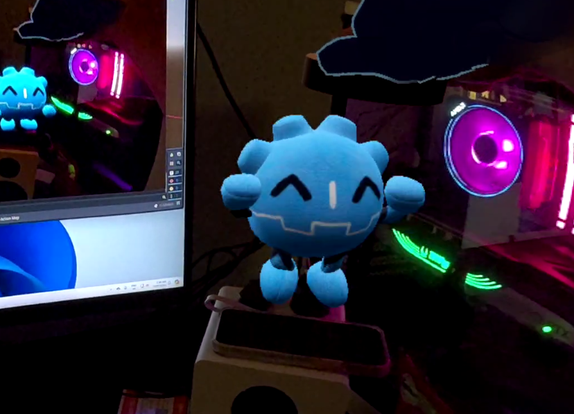

# Godot interactive Plushie for Quest 3 (Godot XR Game Jam July 2024 Entry)

This is our entry for the Godot XR Game Jam, it's a simply toy application.
It uses Metas scene discovery to map out your room and give our toy plushie
room to move around in.

Plushie can get tired and fall asleep, or you can feed it cookies.

## License

The code in this repository falls under an MIT license.
Assets are all under CC0

Note that the plushie was made by [FR3NKD](https://x.com/FR3NKD),
with animation added by Daniel.
